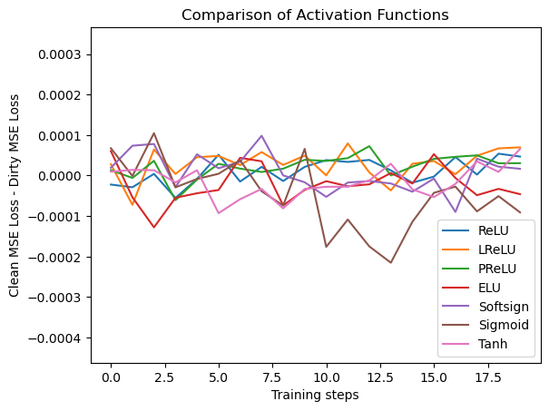
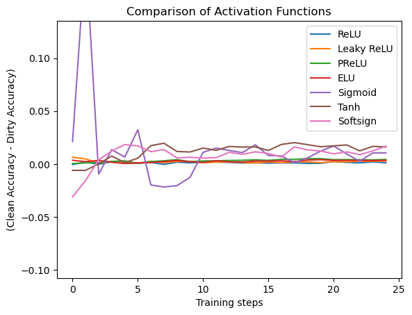

# On the Robustness of Activation Functions

The purpose of this project is to better understand why some activations functions are more robust than others (ReLU vs Sigmoid). 

## Project Hypothesis 

Some of the weaker activations functions (like Sigmoid and Tanh) aren't actually less worse than ReLU-like activation functions. Instead, they have different uses that involve reducing the effect of outliers.

## Usage

To run the multivariate.ipynb notebook:
> `Clear All Output` > `Run All`

To run the conv.ipynb notebook:
> `Clear All Output` > `Run All`

## Dependencies

If you have problems running my code, try upgrading/downgrading your packages to align with what you see below:

| Name         | Version | Build                   | Channel |
| ------------ | ------- | ----------------------- | ------- |
| pytorch      | 1.13.0  | py3.9_cuda11.7_cudnn8_0 | pytorch |
| pytorch-cuda | 11.7    | h67b0de4_0              | pytorch |
| torchvision  | 0.14.0  | pypi_0                  | pypi    |
| tqdm         | 4.64.1  | py39haa95532_0          |         |
| scipy        | 1.7.3   | py39h7a0a035_2          |         |
| python       | 3.9.16  | h6244533_2              |         |
| numpy        | 1.22.4  | pypi_0                  |         |
| matplotlib   | 3.7.1   | py39haa95532_0          |         |
| pandas       | 1.5.3   | py39hf11a4ad_0          |         |
| cuda         | 11.7.1  | nvidia                  |         |

## Pipeline Overview

For each activation function, we do the following:
1. Train on the clean dataset
2. Train on the dirty dataset
3. Test both clean and dirty models on the clean val dataset, choosing the ones that perform best
4. Retrieve the val learning curves for the clean and dirty models
5. Calculate the differential loss (clean - dirty) learning curves.

Then we plot and compare the differential learning curves for all the activation functions

Finally, we repeat the above steps with CNN instead of regression network.

### Clean and Dirty Datasets
**Theory**: Given an input X and output Y, there exists some function F such that F(X) = Y.

The above theory is the foundation of all data science, and the goal of any model is to find this function F or get as close an approximation as possible. Unfortunately, it is often the case that X has some noise to it that causes imprecision in the approximated function F. 

But if we can generate some noiseless dataset X, then it stands to reason any half-decent model could derive the source function with extreme precision. As such, this project has two different datasets; one clean, they other dirty. The clean one is derived purely through a series of mathematical formulas, added together. The dirty one has [Gaussian Noise](https://en.wikipedia.org/wiki/Gaussian_noise#:~:text=In%20signal%20processing%20theory%2C%20Gaussian,can%20take%20are%20Gaussian%2Ddistributed.) added to it via the [np.random.normal](https://numpy.org/doc/stable/reference/random/generated/numpy.random.normal.html) package.

**Expectation**: If my [hypothesis](#project-hypothesis) is correct, then Sigmoid-like activation functions should better reduce the effect of outliers when compared to its ReLU-like counterparts. 

### Data Preprocessing

There is very little pre-processing needed due to the nature of our clean dataset. However, we do still need to do the following:
- normalize each dataset
- split each dataset into train (71%) and val (29%) portions.

### Training and Testing

These are the activation functions I tested for:
- ReLU
- LeakYReLU
- PReLU
- ELU
- Softsign
- Sigmoid
- Tanh

### Comparing the Models

Here is a graph of the resulting comparison of activation functions:

|                         Multivariate                          |                             CNN                             |
| :-----------------------------------------------------------: | :---------------------------------------------------------: |
|  |  |

As you can see, there is no obvious winner in either model type, only an obvious loser in the CNN: Sigmoid. What's more is that the models trained about as well on the clean and dirty datasets, which implies that the dirty dataset was perhaps not very dirty. It could also imply that it was too dirty and the functions instead learned the function for Gaussian Noise.

## Project Conclusion

There is no conclusive evidence that Sigmoid-like functions are better than ReLU-like functions when it comes to reducing the effect that noise has on a model.

## Future Work

When I first learned of their fall in popularity/use, I was determined to find a way to prove that they had more potential than others game them credit for. Unfortunately, as I was unable to prove its usefulness, I have resigned myself to giving up on Sigmoid-like functions. 

If this research was helpful for someone else in realizing what I did wrong or that they are also mistaken, I am happy to share it. 